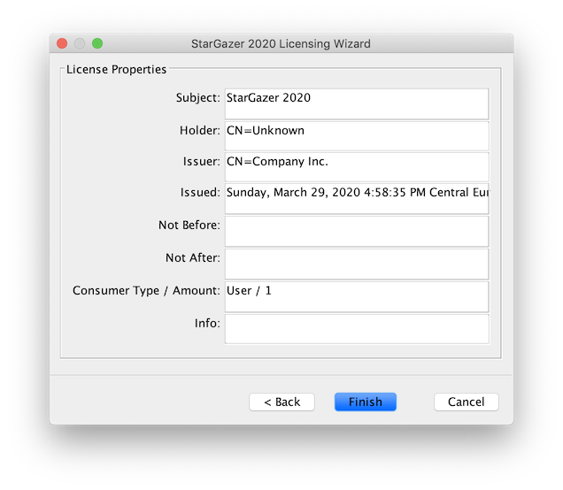

[](https://github.com/christian-schlichtherle/truelicense/releases/latest)
[](http://search.maven.org/#search%7Cga%7C1%7Cg%3A%22global.namespace.truelicense%22) 
[](https://www.apache.org/licenses/LICENSE-2.0)
[](https://travis-ci.org/christian-schlichtherle/truelicense)

# TrueLicense 

TrueLicense is an open source engine for license management on the Java Virtual Machine.
Due to its functional and modular design, it scales from simple to complex licensing schemas.
TrueLicense features various interfaces for managing free trial periods, subscriptions, multiple editions,
internationalization, privacy protection and more.

Before version 4, TrueLicense was covered by the GNU Affero General Public License, Version 3.
Since version 4, it is covered by the Apache License, Version 2.0.

The old documentation at https://truelicense.net/ is now obsolete and will be updated eventually.
In the mean time, please still use it as your reference.

## Quick Start

You can generate a sample project using the
[TrueLicense Maven Archetype](https://github.com/christian-schlichtherle/truelicense-maven-archetype) as follows:

```bash
mvn org.apache.maven.plugins:maven-archetype-plugin:generate \
    -B \
    -DarchetypeGroupId=global.namespace.truelicense-maven-archetype \
    -DarchetypeArtifactId=truelicense-maven-archetype \
    -DarchetypeVersion=4.0.3 \
    -DartifactId=stargazer \
    -Dcompany='Company Inc.' \
    -DgroupId=com.company.product \
    -Dpassword=test1234 \
    -Dsubject='StarGazer 2020' \
    -Dversion=1.0-SNAPSHOT
cd stargazer
chmod +x mvnw
export JAVA_HOME=$(/usr/libexec/java_home -v 11) # for macOS only
./mvnw clean verify
```

Next, you can generate a license key and save it to the file `license.lic` like this:

```bash
$ java -jar keygen/target/*-keygen-*-standalone.jar generate license.lic -output -
{"consumerAmount":1,"consumerType":"User","holder":"CN=Unknown","issued":1565085418292,"issuer":"CN=Company Inc.","subject":"StarGazer 2020"}
```

At this point, you will typically transmit the generated license key to your customer and they will install it into
your software product.
For these purposes, TrueLicense provides many interfaces:

+ There is an application programming interface for generating, installing, verifying and deleting license keys.
+ For the same purposes, there is also a command line interface - you have just used it to generate a license key.
+ There is also a Swing based graphical user interface for installing, verifying and uninstalling license keys.  
+ For the same purposes, there is also a REST based web-interface.

For example, you can install the previously generated license key using the graphical user interface like this:

```bash
java -jar keymgr/target/*-keymgr-*-guarded.jar wizard
```

Follow the instructions of the licensing wizard to install and verify the license key which was previously saved to the
file `license.lic`.
Eventually, the licensing wizard will show you the properties of the installed license key:



You have successfully generated, verified and installed a license key.
Next, you should examine the code which has been generated by the TrueLicense Maven Archetype in order to learn how the
API works and how you can integrate it into your application.